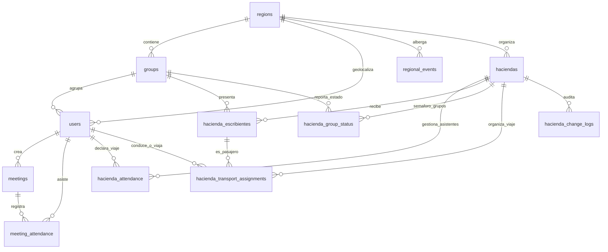

# Diseño de Base de Datos: Plataforma Agua Viva (Asistencia y Logística)

Este documento detalla el diseño de la base de datos relacional para la aplicación móvil y plataforma web de la comunidad **Agua Viva**. La arquitectura está optimizada para manejar roles complejos de servicio, gestión de calendarios paralelos, logística de transporte y el control operativo en tiempo real (**POA**) para eventos masivos (**Haciendas**).

---

## 1. Arquitectura General y Modelo Relacional (ERD)

A continuación se muestra el diagrama de entidad-relación (ERD) del sistema:



---

## 2. Detalle de Requerimientos y Mapeo en Base de Datos

### Requerimiento 1: Autenticación, Registro y Perfiles
* **Registro de nuevos usuarios:** Al registrarse, se solicitan obligatoriamente los datos: `email`, `password_hash`, `phone` (celular), `first_name`, `last_name_initial` (inicial del apellido), `birth_date` (fecha de nacimiento), `region_id`, `group_id` y `sobriety_date` (tiempo de sobriedad).
* **Determinación de JAV (Jóvenes en Agua Viva):** En lugar de requerir que el usuario lo elija, la base de datos calcula automáticamente si el usuario es JAV en base a su edad (rango estricto entre 13 y 18 años al momento del registro) mediante un trigger de base de datos (`trg_set_user_jav`). Esto garantiza consistencia y permite personalizar la interfaz móvil/web según corresponda.
* **Privacidad de Celular:** El número telefónico `phone` es considerado dato privado. Solo usuarios con roles `SUPERADMIN`, `LIDER` (Líderes de Grupo), `AE` (Atracciones Externas) y `AI` (Atracciones Internas) pueden consultarlo en listados.
* **Portal de Aprobaciones del Superadmin:** El `SUPERADMIN` tiene una interfaz de página exclusiva e independiente para gestionar altas y autorizaciones de coordinadores (`LIDER`, `AE` y `AI`) para evitar contraseñas fijas o accesos "hardcoded" en el backend.
  * **Lideres/AE/AI:** Registran su solicitud de rol. Un superusuario (`SUPERADMIN`) los autoriza en su portal específico actualizando los campos `is_approved_leader`, `leader_approved_by` y `leader_approved_at`.
  * **Padrino / Oreja / Apoyo:** Por defecto, los usuarios inician como `NONE` u `APOYO`. Los administradores o superadmins aprueban su cambio a `PADRINO` o `OREJA` y la fecha de cambio se almacena con auditoría.
  * **Servidores Normales e JAV:** Tienen estados de aprobación específicos para validar que el usuario realmente tiene asignada la función (ej. COM, Tesorería, Literatura, RSG).
  * **Nomenclaturas:** Las siglas de Atracciones son formalizadas como **AE (Atracciones Externas)** e **AI (Atracciones Internas)**.

### Requerimiento 2: Roles y Permisos (Seguridad)
* La tabla `users` clasifica a los usuarios en roles principales: `SUPERADMIN`, `LIDER`, `AE`, `AI` y `MEMBER`.
* Los usuarios con roles `LIDER`, `AE` y `AI` tienen permisos de **escritura, edición y eliminación** en tablas que pertenecen a su mismo `group_id` o `region_id`. Las políticas de seguridad (RLS - Row Level Security) en PostgreSQL pueden implementarse fácilmente usando esta estructura para limitar el acceso.

### Requerimiento 3: Calendarios Múltiples y Juntas Concurrentes
* Para soportar juntas que ocurren de forma paralela y calendarios independientes, el sistema cuenta con:
  * **Calendario de Grupo:** Administrado por sus asesores (AE's y AI's).
  * **Calendario Regional:** Administrado a nivel región.
  * **Calendario Anual:** Global para toda la comunidad de Agua Viva.
* La tabla `meetings` contiene el campo `scope` (`GROUP`, `REGIONAL`, `ANNUAL`) para clasificar eventos, y relaciones directas a `group_id` y `region_id`.
* Las juntas tipo `NORMAL` exigen un tema (`theme`) y ponente (`ponente`), mientras que otros tipos como *Consagración*, *Tribuna*, *Preparaciones JAV*, etc., se crean con datos flexibles.

### Requerimiento 4: Estructura Geográfica (Regiones y Grupos)
El diseño contempla las 9 regiones solicitadas y permite expandirlas o reducirlas fácilmente. Las relaciones entre las regiones y los grupos están normalizadas para evitar redundancia y garantizar la integridad de datos:
* **Región 1 (CDMX):** Zaragoza, Sur, Satélite, Chicoloapan, San Cosme, Cuernavaca, Neza, San Cristóbal, Ermita, Santa María, Jiutepec, Zacatepec, Mirador, Aragón, Alamedas, Coapan.
* **Región 2 (Estado de México):** Teoloyucan, Tlalnepantla, Pachuca, Caracoles, Atizapán, Nextlalpan, Coacalco, Atlacomulco, Tizayuca, Cuautitlán, Nicolás Romero.
* **Región 3 (Querétaro y Guanajuato):** Satélite, Salitre, León.
* **Región 4 (Puebla):** Apizaco, Guadalupe Hidalgo (Pipis), San Felipe, Tlaxcala, Cholula, Zacatelco, Buenavista, San Baltazar, Amalucan, Amozoc, Huamantla, Contla.
* **Región 5 (Guerrero):** Chilpancingo, Coloso, Mozimba, San Jerónimo, Acahuizotla, Hacienda de Cabañas, Coyuca, Atoyac, Chichihualco.
* **Región 6 (Yucatán):** Cancún, Caribe, Mérida, Hunucmá, Conkal.
* **Región 7 (Chicago):** Aurora, Minoora, Chicago.
* **Región 8 (Veracruz):** Cuitláhuac, Tinaja, Tierra Blanca, Capilla, Carranza, Amapolas, Córdoba.
* **Región 9 (Monterrey):** Monterrey.

### Requerimiento 5: Sección Exclusiva JAV
* En el desarrollo frontend, la aplicación móvil y web usará la bandera `is_jav = TRUE` en la sesión del usuario para renderizar un tema visual diferente y priorizar los eventos y juntas JAV (como *Preparaciones JAV*, *Juntas JAV*, *Juntas de Padres JAV*).
* A nivel base de datos, las consultas filtran juntas donde `meeting_type` está en la categoría JAV o eventos regionales asignados a JAV.

### Requerimiento 6: Haciendas y POA (Logística en Tiempo Real)
* **Asistencia y Turnos:** Al aproximarse una Hacienda de su región, el usuario declara si asistirá y selecciona su turno de llegada (`arrival_shift`): *Pre-avanzada (Jueves)*, *Avanzada (Viernes mañana con escribientes)*, *Viernes Tarde/Noche*, *Sábado Mañana*, *Sábado Tarde/Noche*, *Domingo*.
* **Transporte y Asignaciones:** La tabla `hacienda_attendance` almacena si el miembro provee transporte (`PROVIDES_TRANSPORT`) y cuántos lugares libres tiene (`transport_capacity`), o si lo necesita (`NEEDS_TRANSPORT`). La tabla `hacienda_transport_assignments` mapea qué pasajeros van con qué chofer de forma dinámica.
* **Escribientes:** Los encargados de Atracciones y Líderes registran los datos de los escribientes en `hacienda_escribientes` (Nombre, Inicial del Apellido, Género y Grupo).
* **Semáforo de Carga (Red, Yellow, Green):** En `hacienda_group_status` se monitorea el nivel de carga de información de cada grupo para el evento.
  * **ROJO (RED):** El grupo no ha ingresado información.
  * **AMARILLO (YELLOW):** Información subida a borrador, pendiente de rectificar.
  * **VERDE (GREEN):** Datos rectificados y aprobados por Atracciones.
* **Registro de Cambios (Audit Log):** La tabla `hacienda_change_logs` registra cada inserción, edición o eliminación de escribientes y logística para permitir un control de auditoría transparente y visible para los líderes y atracciones.

### Requerimiento 7: Miembros
* La sección de miembros ejecuta búsquedas rápidas utilizando los índices sobre `users(region_id, group_id)` para retornar listas instantáneas de quiénes son Padrinos, Orejas, Apoyos y JAVs en el grupo o la región correspondiente.

---

## 3. Consultas SQL Clave (Ejemplos de Implementación)

### Consulta A: Dashboard de Totales Generales para una Hacienda
Esta consulta genera los totales requeridos por los coordinadores para conocer las métricas globales del evento.

```sql
SELECT 
    h.title AS hacienda_name,
    -- Total de Escribientes
    (SELECT COUNT(*) FROM hacienda_escribientes WHERE hacienda_id = h.id) AS total_escribientes,
    -- Total de Apoyos asistentes
    (SELECT COUNT(*) FROM hacienda_attendance ha 
     JOIN users u ON ha.user_id = u.id 
     WHERE ha.hacienda_id = h.id AND ha.attending = TRUE AND u.oyp_status = 'APOYO') AS total_apoyos,
    -- Total de Orejas asistentes
    (SELECT COUNT(*) FROM hacienda_attendance ha 
     JOIN users u ON ha.user_id = u.id 
     WHERE ha.hacienda_id = h.id AND ha.attending = TRUE AND u.oyp_status = 'OREJA') AS total_orejas,
    -- Total de Padrinos asistentes
    (SELECT COUNT(*) FROM hacienda_attendance ha 
     JOIN users u ON ha.user_id = u.id 
     WHERE ha.hacienda_id = h.id AND ha.attending = TRUE AND u.oyp_status = 'PADRINO') AS total_padrinos,
    -- Total de JAVs asistentes
    (SELECT COUNT(*) FROM hacienda_attendance ha 
     JOIN users u ON ha.user_id = u.id 
     WHERE ha.hacienda_id = h.id AND ha.attending = TRUE AND u.is_jav = TRUE) AS total_javs,
    -- Total de personas que requieren transporte
    (SELECT COUNT(*) FROM hacienda_attendance WHERE hacienda_id = h.id AND attending = TRUE AND transport_status = 'NEEDS_TRANSPORT') AS necesitan_transporte,
    -- Total de asientos disponibles ofrecidos por servidores
    (SELECT COALESCE(SUM(transport_capacity), 0) FROM hacienda_attendance WHERE hacienda_id = h.id AND attending = TRUE AND transport_status = 'PROVIDES_TRANSPORT') AS asientos_ofrecidos
FROM haciendas h
WHERE h.id = 'ID_DE_LA_HACIENDA_AQUI';
```

### Consulta B: Monitoreo de Semáforo (POA) por Grupo en una Región
Permite a los Atracciones visualizar en tiempo real qué grupos han subido su información para una hacienda determinada.

```sql
SELECT 
    g.name AS grupo_name,
    COALESCE(hgs.status, 'RED') AS estado_semaforo,
    hgs.updated_at AS ultima_actualizacion,
    u.first_name || ' ' || u.last_name_initial || '.' AS actualizado_por,
    (SELECT COUNT(*) FROM hacienda_escribientes WHERE hacienda_id = hgs.hacienda_id AND group_id = g.id) AS escribientes_cargados
FROM groups g
LEFT JOIN hacienda_group_status hgs ON g.id = hgs.group_id AND hgs.hacienda_id = 'ID_DE_LA_HACIENDA_AQUI'
LEFT JOIN users u ON hgs.last_updated_by = u.id
WHERE g.region_id = 'ID_DE_LA_REGION_AQUI'
ORDER BY grupo_name ASC;
```

### Consulta C: Reporte de Movilidad (Coordinación de Transporte)
Lista los conductores disponibles, su cupo y los pasajeros que tienen asignados hasta el momento.

```sql
SELECT 
    driver.first_name || ' ' || driver.last_name_initial || '.' AS conductor_nombre,
    ha.transport_capacity AS capacidad_total,
    COUNT(hta.id) AS asientos_ocupados,
    (ha.transport_capacity - COUNT(hta.id)) AS asientos_libres,
    STRING_AGG(
        COALESCE(pass_u.first_name || ' ' || pass_u.last_name_initial || '.', pass_e.first_name || ' ' || pass_e.last_name_initial || '. (Escribiente)'),
        ', '
    ) AS pasajeros_asignados
FROM hacienda_attendance ha
JOIN users driver ON ha.user_id = driver.id
LEFT JOIN hacienda_transport_assignments hta ON hta.driver_id = driver.id AND hta.hacienda_id = ha.hacienda_id
LEFT JOIN users pass_u ON hta.passenger_user_id = pass_u.id
LEFT JOIN hacienda_escribientes pass_e ON hta.passenger_escribiente_id = pass_e.id
WHERE ha.hacienda_id = 'ID_DE_LA_HACIENDA_AQUI' 
  AND ha.attending = TRUE 
  AND ha.transport_status = 'PROVIDES_TRANSPORT'
GROUP BY driver.id, driver.first_name, driver.last_name_initial, ha.transport_capacity, ha.hacienda_id;
```
