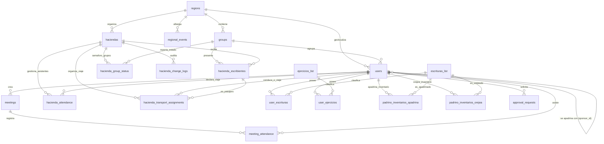

# Diseño de Base de Datos: Plataforma Agua Viva (Asistencia y Logística)

Este documento detalla el diseño de la base de datos relacional para la aplicación móvil y plataforma web de la comunidad **Agua Viva**. La arquitectura está optimizada para manejar roles complejos de servicio, gestión de calendarios paralelos, logística de transporte y el control operativo en tiempo real (**POA**) para eventos masivos (**Haciendas**).

---

## 1. Arquitectura General y Modelo Relacional (ERD)

A continuación se muestra el diagrama de entidad-relación (ERD) del sistema:



---

## 2. Detalle de Requerimientos y Mapeo en Base de Datos

### Requerimiento 1: Autenticación, Registro y Perfiles Expandidos
* **Registro de nuevos usuarios:** Al registrarse, se solicitan obligatoriamente los datos: `email` (con bandera de verificación), `password_hash` (validación de al menos una mayúscula, una minúscula y un número; sin caracteres especiales), `phone` (celular), `first_name` (nombre), `last_name_initial` (inicial del apellido), `birth_date` (fecha de nacimiento), `region_id`, `group_id`, `sobriety_date` (tiempo de sobriedad en mes/año), `estigma` (`estigma_enfermedad_enum`: ALCOHOLISMO, DROGADICCION, CODEPENDENCIA, ANOREXIA, BULINOREXICA, DEPENDIENTE, NEUROSIS), `terms_accepted` (aceptación de resguardo y responsabilidad de datos).
* **Determinación de JAV (Jóvenes en Agua Viva):** Si el usuario se registra con edad de 13 a 17 años (o selecciona JAV = Sí), la base de datos o el backend activa `is_jav = TRUE`. En este flujo se despliegan los servicios específicos JAV (`servicio_jav_enum`). La selección de un servicio JAV queda marcada como pendiente hasta que el **Líder de Grupo** la valide.
* **Estructura de Servicios y Roles de Coordinación:**
  * **Servicios de Adultos (`servicio_adulto_enum`):** `LIDER`, `AE`, `AI`, `COM` (Oración y Meditación), `TG` (Tesorería), `MANAGER` (Logística de Hacienda y Kits), `SECRETARIO`, `RSG`, `LITERATURA`, `PPI`, `COORDINADOR_HACIENDA`, `PASO_12` y `COACH_JAV`.
  * **Servicios de Jóvenes (`servicio_jav_enum`):** `REPRESENTANTE_JAV`, `AE_JAV`, `AI_JAV`, `COM_JAV`, `PPI_JAV` y `COORDINADOR_HACIENDA_JAV`.
  * Si un usuario selecciona un servicio, este se registra pero queda en espera de confirmación. Si selecciona `LIDER`, la aprobación pasa a la cola del `SUPERADMIN`. Para los demás servicios, es aprobada por el `LIDER` del grupo.
* **POA (Apoyo, Oreja, Padrino):**
  * **Apoyo:** Guarda la fecha inicial de apoyo (`apoyo_since`, desde cuándo nació / primera escritura).
  * **Oreja:** Guarda la fecha de primera consagración (`oreja_since`).
  * **Padrino:** Guarda la fecha de consagración (`padrino_since`), los inventarios que apadrina en la tabla `padrino_inventarios_apadrina` y los que orejea en `padrino_inventarios_orejea`. Su alta como Padrino queda en espera de confirmación por el **Líder de Grupo**.
* **Apadrinamiento Cruzado (Sponsorship):** Cada usuario registra su `sponsor_id`. Por defecto se listan los Padrinos aprobados de su propio grupo. Si su Padrino pertenece a otro grupo de la región, el usuario puede filtrar por grupo en la región para desplegar e indicar su Padrino. Se muestra en pantalla como "Se apadrina con:".
* **Historial de Escrituras y Ejercicios:** 
  * La tabla `user_escrituras` contiene las escrituras normales (1er Inventario, 10mo de primera, 2do, 10mo de segunda, 3er, 10mo de tercera, pre-cuarta, 4to inventario) and de servidores (1ra, 2da, 3ra de servidores). Todos los usuarios tienen el `1er Inventario` por defecto.
  * La tabla `user_ejercicios` almacena los ejercicios de seguimiento (Trinity, LBD, Duelo, Desierto, Niño).
  * Cualquier edición o adición de escrituras/ejercicios posteriores queda en espera de confirmación del Líder.
* **Privacidad de Celular y Avatar:** El número de teléfono `phone` se enmascara en el frontend con efecto difuminado (`blur`) para miembros generales. Solo coordinadores autorizados (`LIDER`, `AE`, `AI`, `SUPERADMIN`) pueden verlos en texto plano. Los usuarios pueden cargar una imagen en `avatar_url` para que el líder y las atracciones lo identifiquen rápidamente en la planeación del POA.
* **Flujo de Degradación Voluntaria (Padrino ➡️ Oreja ➡️ Apoyo):** Al editar el perfil y bajar el estatus de POA, el sistema requiere capturar un campo de justificación (`downgrade_reason`) que se almacena en la tabla `approval_requests` para auditoría y es visible únicamente por el Líder de Grupo.
* **Buzón de Aprobaciones (`approval_requests`):** Tabla centralizada en base de datos que encola cambios sensibles (roles, servicios, traspasos de región/grupo, POA, nuevas escrituras) pendientes de resolución por el Líder (o Superadmin). El usuario puede navegar normalmente con permisos básicos mientras su solicitud es atendida.ar normalmente con permisos básicos mientras su solicitud es atendida.

### Requerimiento 2: Roles y Permisos (Seguridad)
* La tabla `users` clasifica a los usuarios en roles principales: `SUPERADMIN`, `LIDER`, `AE`, `AI` y `MEMBER`.
* Los roles de coordinación (`LIDER`, `AE` y `AI`) son homólogos a nivel de facultades de base de datos. Si un grupo o región carece de Atracciones (AE/AI), el Líder de Grupo asume la responsabilidad total de las operaciones (crear eventos, actualizar semáforos, coordinar transporte y validar escribientes). Poseen permisos de **escritura, edición y eliminación** en las tablas operativas del grupo y región.

### Requerimiento 3: Calendarios Múltiples y Juntas Concurrentes
* Para soportar juntas que ocurren de forma paralela y calendarios independientes, el sistema cuenta con:
  * **Calendario de Grupo:** Administrado por sus asesores (Líderes, AE's y AI's).
  * **Calendario Regional:** Administrado a nivel región.
  * **Calendario Anual:** Global para toda la comunidad de Agua Viva.
* La tabla `meetings` contiene el campo `scope` (`GROUP`, `REGIONAL`, `ANNUAL`) para clasificar eventos, y relaciones directas a `group_id` y `region_id`.
* Las juntas tipo `NORMAL` exigen un tema (`theme`) y ponente (`ponente`), mientras que otros tipos como *Consagración*, *Tribuna*, *Preparaciones JAV*, etc., se crean con datos flexibles.

### Requerimiento 4: Estructura Geográfica (Regiones y Grupos)
El diseño contempla las 9 regiones solicitadas y permite expandirlas o reducirlas fácilmente. Las relaciones entre las regiones y los grupos están normalizadas para evitar redundancia y garantizar la integridad de datos:
* **Región 1 (CDMX):** Zaragoza, Sur, Satélite, Chicoloapan, San Cosme, Cuernavaca, Neza, San Cristóbal, Ermita, Santa María, Jiutepec, Zacatepec, Mirador, Aragón, Alamedas, Coapan.
* **Región 2 (Estado de México):** Teoloyucan, Tlalnepantla, Pachuca, Caracoles, Atizapán, Nextlalpan, Coacalco, Atlacomulco, Tizayuca, Cuautitlán, Nicolás Romero.
* **Región 3 (Querétaro y Guanajuato):** Satélite, Salitre, León.
* **Región 4 (Puebla):** Apizaco, Guadalupe Hidalgo (Pipis), San Felipe, Tlaxcala, Cholula, Zacatelco, Buenavista, San Baltazar, Amalucan, Amozoc, Huamantla, Contla.
* **Región 5 (Guerrero):** Chilpancingo, Coloso, Mozimba, San Jerónimo, Acahuizotla, Hacienda de Cabañas, Coyuca, Atoyac, Chichihualco.
* **Región 6 (Yucatán):** Cancún, Caribe, Mérida, Hunucmá, Conkal.
* **Región 7 (Chicago):** Aurora, Minoora, Chicago.
* **Región 8 (Veracruz):** Cuitláhuac, Tinaja, Tierra Blanca, Capilla, Carranza, Amapolas, Córdoba.
* **Región 9 (Monterrey):** Monterrey.

### Requerimiento 5: Sección Exclusiva JAV
* En el desarrollo frontend, la aplicación móvil y web usará la bandera `is_jav = TRUE` en la sesión del usuario para renderizar un tema visual diferente y priorizar los eventos y juntas JAV (como *Preparaciones JAV*, *Juntas JAV*, *Juntas de Padres JAV*).
* A nivel base de datos, las consultas filtran juntas donde `meeting_type` está en la categoría JAV o eventos regionales asignados a JAV.

### Requerimiento 6: Haciendas y POA (Logística en Tiempo Real)
* **Sincronización del Calendario Anual:** Las Haciendas se crean e instancian a partir de eventos globales registrados en el Calendario Anual. Esto se valida a nivel base de datos mediante la columna `annual_meeting_id` y el índice único `unique_annual_hacienda_per_region`, previniendo que coordinadores o líderes dupliquen registros de logística para un mismo retiro regional.
* **Asistencia y Turnos:** Al aproximarse una Hacienda de su región, el usuario declara si asistirá y selecciona su turno de llegada (`arrival_shift`): *Pre-avanzada (Jueves)*, *Avanzada (Viernes mañana con escribientes)*, *Viernes Tarde/Noche*, *Sábado Mañana*, *Sábado Tarde/Noche*, *Domingo*.
* **Transporte y Asignaciones:** La tabla `hacienda_attendance` almacena si el miembro provee transporte (`PROVIDES_TRANSPORT`) y cuántos lugares libres tiene (`transport_capacity`), o si lo necesita (`NEEDS_TRANSPORT`). La tabla `hacienda_transport_assignments` mapea qué pasajeros van con qué chofer de forma dinámica.
* **Escribientes:** Los coordinadores (Líderes y Atracciones) registran los datos de los escribientes en `hacienda_escribientes` (Nombre, Inicial del Apellido, Género y Grupo).
* **Semáforo de Carga y Rectificación (Red, Yellow, Green):** En `hacienda_group_status` se monitorea el nivel de carga de información de cada grupo para el evento. Los coordinadores pueden ingresar y rectificar una lista unificada que contiene tanto a los escribientes como a los servidores (apoyos, orejas, padrinos, transportes y JAVs) que llenaron previamente su encuesta.
  * **ROJO (RED):** El grupo no ha ingresado información.
  * **AMARILLO (YELLOW):** Lista guardada por los líderes, pendiente de validación o rectificación final.
  * **VERDE (GREEN):** Lista de militancia rectificada y aprobada formalmente.
* **Registro de Cambios (Audit Log):** La tabla `hacienda_change_logs` registra cada inserción, edición o eliminación en la lista de escribientes y logística para permitir un control de auditoría transparente y visible para todos los coordinadores.

### Requerimiento 7: Miembros
* La sección de miembros ejecuta búsquedas rápidas utilizando los índices sobre `users(region_id, group_id)` para retornar listas instantáneas de quiénes son Padrinos, Orejas, Apoyos y JAVs en el grupo o la región correspondiente.

---

## 3. Consultas SQL Clave (Ejemplos de Implementación)

### Consulta A: Dashboard de Totales Generales para una Hacienda
Esta consulta genera los totales requeridos por los coordinadores para conocer las métricas globales del evento.

```sql
SELECT 
    h.title AS hacienda_name,
    -- Total de Escribientes
    (SELECT COUNT(*) FROM hacienda_escribientes WHERE hacienda_id = h.id) AS total_escribientes,
    -- Total de Apoyos asistentes
    (SELECT COUNT(*) FROM hacienda_attendance ha 
     JOIN users u ON ha.user_id = u.id 
     WHERE ha.hacienda_id = h.id AND ha.attending = TRUE AND u.experiencia_nivel = 'APOYO') AS total_apoyos,
    -- Total de Orejas asistentes
    (SELECT COUNT(*) FROM hacienda_attendance ha 
     JOIN users u ON ha.user_id = u.id 
     WHERE ha.hacienda_id = h.id AND ha.attending = TRUE AND u.experiencia_nivel = 'OREJA') AS total_orejas,
    -- Total de Padrinos asistentes
    (SELECT COUNT(*) FROM hacienda_attendance ha 
     JOIN users u ON ha.user_id = u.id 
     WHERE ha.hacienda_id = h.id AND ha.attending = TRUE AND u.experiencia_nivel = 'PADRINO') AS total_padrinos,
    -- Total de JAVs asistentes
    (SELECT COUNT(*) FROM hacienda_attendance ha 
     JOIN users u ON ha.user_id = u.id 
     WHERE ha.hacienda_id = h.id AND ha.attending = TRUE AND u.is_jav = TRUE) AS total_javs,
    -- Total de personas que requieren transporte
    (SELECT COUNT(*) FROM hacienda_attendance WHERE hacienda_id = h.id AND attending = TRUE AND transport_status = 'NEEDS_TRANSPORT') AS necesitan_transporte,
    -- Total de asientos disponibles ofrecidos por servidores
    (SELECT COALESCE(SUM(transport_capacity), 0) FROM hacienda_attendance WHERE hacienda_id = h.id AND attending = TRUE AND transport_status = 'PROVIDES_TRANSPORT') AS asientos_ofrecidos
FROM haciendas h
WHERE h.id = 'ID_DE_LA_HACIENDA_AQUI';
```

### Consulta B: Monitoreo de Semáforo (POA) por Grupo en una Región
Permite a los Atracciones visualizar en tiempo real qué grupos han subido su información para una hacienda determinada.

```sql
SELECT 
    g.name AS grupo_name,
    COALESCE(hgs.status, 'RED') AS estado_semaforo,
    hgs.updated_at AS ultima_actualizacion,
    u.first_name || ' ' || u.last_name_initial || '.' AS actualizado_por,
    (SELECT COUNT(*) FROM hacienda_escribientes WHERE hacienda_id = hgs.hacienda_id AND group_id = g.id) AS escribientes_cargados
FROM groups g
LEFT JOIN hacienda_group_status hgs ON g.id = hgs.group_id AND hgs.hacienda_id = 'ID_DE_LA_HACIENDA_AQUI'
LEFT JOIN users u ON hgs.last_updated_by = u.id
WHERE g.region_id = 'ID_DE_LA_REGION_AQUI'
ORDER BY grupo_name ASC;
```

### Consulta C: Reporte de Movilidad (Coordinación de Transporte)
Lista los conductores disponibles, su cupo y los pasajeros que tienen asignados hasta el momento.

```sql
SELECT 
    driver.first_name || ' ' || driver.last_name_initial || '.' AS conductor_nombre,
    ha.transport_capacity AS capacidad_total,
    COUNT(hta.id) AS asientos_ocupados,
    (ha.transport_capacity - COUNT(hta.id)) AS asientos_libres,
    STRING_AGG(
        COALESCE(pass_u.first_name || ' ' || pass_u.last_name_initial || '.', pass_e.first_name || ' ' || pass_e.last_name_initial || '. (Escribiente)'),
        ', '
    ) AS pasajeros_asignados
FROM hacienda_attendance ha
JOIN users driver ON ha.user_id = driver.id
LEFT JOIN hacienda_transport_assignments hta ON hta.driver_id = driver.id AND hta.hacienda_id = ha.hacienda_id
LEFT JOIN users pass_u ON hta.passenger_user_id = pass_u.id
LEFT JOIN hacienda_escribientes pass_e ON hta.passenger_escribiente_id = pass_e.id
WHERE ha.hacienda_id = 'ID_DE_LA_HACIENDA_AQUI' 
  AND ha.attending = TRUE 
  AND ha.transport_status = 'PROVIDES_TRANSPORT'
GROUP BY driver.id, driver.first_name, driver.last_name_initial, ha.transport_capacity, ha.hacienda_id;
```

### Consulta D: Reporte de Padrinos y sus Especialidades
Lista los padrinos activos y aprobados, indicando el número de ahijados asignados y el catálogo de inventarios que pueden apadrinar u orejear.

```sql
SELECT 
    u.first_name || ' ' || u.last_name_initial || '.' AS padrino_nombre,
    u.padrino_since AS consagrado_desde,
    (SELECT COUNT(*) FROM users WHERE sponsor_id = u.id) AS ahijados_activos,
    STRING_AGG(DISTINCT el_apadrina.name, ', ') AS inventarios_que_apadrina,
    STRING_AGG(DISTINCT el_orejea.name, ', ') AS inventarios_que_orejea
FROM users u
LEFT JOIN padrino_inventarios_apadrina pia ON u.id = pia.user_id
LEFT JOIN escrituras_list el_apadrina ON pia.escritura_id = el_apadrina.id
LEFT JOIN padrino_inventarios_orejea pio ON u.id = pio.user_id
LEFT JOIN escrituras_list el_orejea ON pio.escritura_id = el_orejea.id
WHERE u.experiencia_nivel = 'PADRINO' AND u.is_approved_experiencia = TRUE
GROUP BY u.id, u.first_name, u.last_name_initial, u.padrino_since;
```

### Consulta E: Cola de Aprobaciones Pendientes del Líder de Grupo
Lista las solicitudes pendientes de resolución para un determinado grupo.

```sql
SELECT 
    ar.id AS solicitud_id,
    u.first_name || ' ' || u.last_name_initial || '.' AS solicitante,
    ar.request_type AS tipo_solicitud,
    ar.requested_data AS datos_solicitados,
    ar.downgrade_reason AS motivo_degradacion,
    ar.created_at AS fecha_solicitud
FROM approval_requests ar
JOIN users u ON ar.user_id = u.id
WHERE u.group_id = 'ID_DEL_GRUPO_AQUI' AND ar.status = 'PENDING'
ORDER BY ar.created_at ASC;
```
